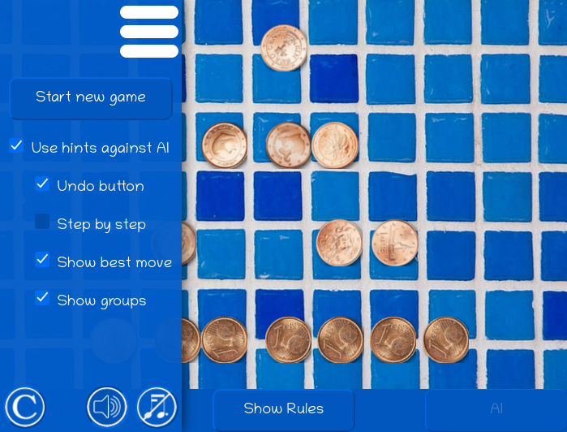

# A pure Node project: Dr Nim

Nim is a game where you and your opponent take tokens (such as coins, marbles, matches, ...) from a set of tokens. The player who takes the last token loses. The number of tokens you can take at each turn must be between 1 and pre-agreed upper limit.

Below is a link to a fun video that shows how a piece of plastic called Dr Nim can play you at this game and beat you every time... unless you know the secret of how to win.

[](https://www.youtube.com/watch?v=9KABcmczPdg)

---
# An Easy Challenge
This repository contains a game written in NodeJS that works just like Dr Nim, except that:
* It shows the progress of the game in a Terminal window
* You will need to write a function called `player` to play against it.

The "Dr Nim" player plays perfectly, and the two players take turns to start for each new game. As a result, the best result you can hope for is to win exactly 50% of the time.

---
# Instructions

1. Clone this repository to your laptop
2. Open the file at `You/player.js` and create the code for the `player` function.


```javascript
const player = (tokensRemaining, maxTokensToTake) => {
  // Write your code to calculate the best move here
}
```

3. In a Terminal window, run `node index.js`. Before you write any code, you will see this:

```bash
*******************************
Round 1 of 4
The game starts with 12 tokens.
Player "You" to start.
*******************************
    
You failed to play. Dr Nim wins by forfeit.
FIX YOUR CODE.
```

When you have your code working perfectly, you should see something like this:

```bash
*******************************
Round 1 of 4
The game starts with 12 tokens.
Player "You" to start.
*******************************

<SNIP>

Dr Nim wins round 1!

<SNIP>

You win round 2!

<SNIP>

Dr Nim wins round 3!

*******************************
Round 4 of 4
The game starts with 12 tokens.
Player "Dr Nim" to start.
*******************************
    
Dr Nim takes 1 token, leaving 11 tokens.
You take 3 tokens, leaving 8 tokens.
Dr Nim takes 1 token, leaving 7 tokens.
You take 3 tokens, leaving 4 tokens.
Dr Nim takes 1 token, leaving 3 tokens.
You take 3 tokens, leaving 0 tokens.
You win round 4!

Wins: { 'Dr Nim': 2, You: 2 }
```

# Levelling up

Dr Nim plays a simple "linear" game.

The classic game of Nim has four lines of tokens. You can learn how to play it here:

[](https://withkoji.com/en/~blackslate/nim)

(Click on the image above to open the link.)

I designed this version of the game to train you step-by-step until you can win against the AI.

# The Real Challenge

You now know enough JavaScript code to write an engine that will play the full four-line classic game of Nim. The question is: do you know how to write the "Artificial Intelligence" for this?

Here's a clue: mentally divide each line of tokens up into groups of 4, 2 and 1. Remove the tokens that will leave even numbers of each kind of group. (If you select the Show Best Move and Show Groups checkboxes in the interactive game above, you will see how the 4, 2, 1 grouping works... until the very last move.)

If you want a(n almost) complete tutorial on how to write this game for in JavaScript, HTML and CSS, [here's one ](https://blackslate.github.io/nim-tutorial/) that I wrote when my skills in these matters was not much better than yours could be now.

**So here's the real challenge:**

Modify the Dr Nim repo so that it can play the classic game of Nim.
1. Create new folder called "Me", containing a second `player.js` script. (This second script will take precedence over "Dr Nim".)
2. Modify your two `player` functions:
   * They should accept an array of four numbers. Each number will represent the number of tokens in a particular line. At the beginning of the game, the array should be `[1, 3, 5, 7]`. When the losing player is forced to take the last token, it might be `[0, 0, 1, 0]`, for example.
   * The value returned by the functions should be a two-item object, like `{ remove: 2, fromRow: 3 }`
   * You can make one of the `player` functions choose a random legal move (like a naive player).
   * You can fine-tune the other `player` function to always make the best move, so that it will always win.
3. Modify the `index.js` script:
   * It should send the `player` functions an array argument, representing the current state of play.
   * It should detect if a `player` function sends an illegal response or fails to respond, and halt the game in this case.
   * It should update this array, following the instructions in the object return by the call to the `player` function.
   * It should use console.log() to display the current state of the game in the Terminal window after each turn.
   * It should announce the winner of each round.
   * It should show how the total number of rounds that each `player` won.
  
When you think your expert `player` is ready, you can share it with others who have accepted this challenge. Your `player` should win at least 50% of the time against any other opponent.

If you have any questions, don't hesitate to contact me on Slack.

Have fun!