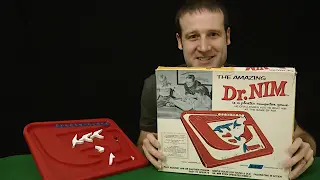

# A pure Node project: Dr Nim

Nim is a game where you and your opponent take tokens (such as coins, marbles, matches, ...) from a set of tokens. The player who takes the last token loses. The number of tokens you can take at each turn must be between 1 and pre-agreed upper limit.

Below is a link to a fun video that shows how a piece of plastic called Dr Nim can play you at this game and beat you every time... unless you know the secret of how to win.

[](https://www.youtube.com/watch?v=9KABcmczPdg)

---
# An Easy Challenge
This repository contains a game written in NodeJS that works just like Dr Nim, except that:
* It shows the progress of the game in a Terminal window
* You will need to write a function called `player` to play against it.

The "Dr Nim" player plays perfectly, and the two players take turns to start for each new game. As a result, the best result you can hope for is to win exactly 50% of the time.

---
# Instructions

1. Clone this repository to your laptop
2. Open the file at `You/player.js` and create the code for the `player` function.


```javascript
const player = (tokensRemaining, maxTokensToTake) => {
  // Write your code to calculate the best move here
}
```

3. In a Terminal window, run `node index.js`. Before you write any code, you will see this:

```bash
*******************************
Round 1 of 4
The game starts with 12 tokens.
Player "You" to start.
*******************************
    
You failed to play. Dr Nim wins by forfeit.
FIX YOUR CODE.
```

When you have your code working perfectly, you should see something like this:

```bash
*******************************
Round 1 of 4
The game starts with 12 tokens.
Player "You" to start.
*******************************

<SNIP>

Dr Nim wins round 1!

<SNIP>

You win round 2!

<SNIP>

Dr Nim wins round 3!

*******************************
Round 4 of 4
The game starts with 12 tokens.
Player "Dr Nim" to start.
*******************************
    
Dr Nim takes 1 token, leaving 11 tokens.
You take 3 tokens, leaving 8 tokens.
Dr Nim takes 1 token, leaving 7 tokens.
You take 3 tokens, leaving 4 tokens.
Dr Nim takes 1 token, leaving 3 tokens.
You take 3 tokens, leaving 0 tokens.
You win round 4!

Wins: { 'Dr Nim': 2, You: 2 }
```

